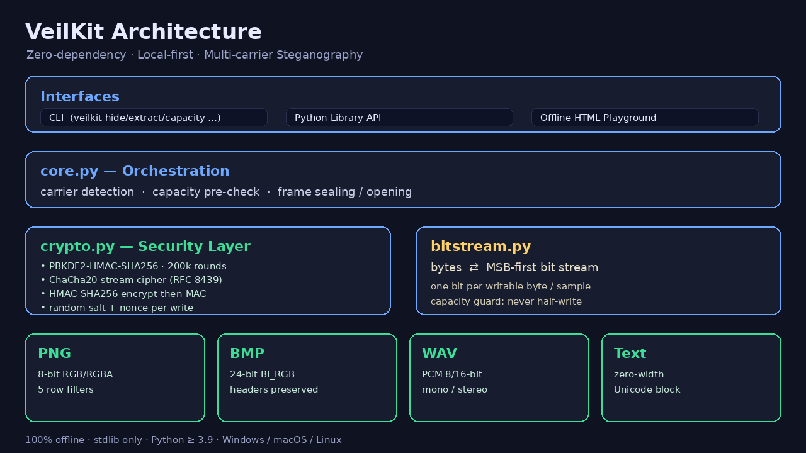

# 🫥 VeilKit · 隱紗匣

**零依賴 · 本地優先 · 多載體隱寫工具箱**
把任意檔案或文字「隱形」藏進圖片、音訊與一般文字中，可選用軍規級口令加密，全程離線、不上傳、不留痕。

🌐 **語言切換 / Language：** [简体中文](../README.md) ｜ [繁體中文](./README_zh-TW.md) ｜ [English](./README_EN.md)

<p align="center">
  
</p>

> 📸 *展示動圖佔位：`docs/demo.gif` —— 一道命令把加密檔案藏進 PNG，再原樣取出*

---

## 🎉 專案介紹

**VeilKit（隱紗匣）** 是一個完全以 Python 標準函式庫實作的多載體**隱寫術（Steganography）**工具箱。
與「加密」不同，隱寫追求的是**隱藏通訊本身的存在**：外人看到的只是一張普通圖片、一段錄音或一句平常的話，
真正的內容則以最低有效位元（LSB）或零寬字元的形式潛伏其中，唯有持有載體與口令的人才能取出。

### 🎯 解決了什麼痛點

- 😮‍💨 **現有工具不是要裝一堆依賴，就是得連網上傳**——敏感檔案交給陌生網站始終不放心；
- 🧩 **多數開源實作只支援單一載體**，PNG 能藏、音訊/文字就得換工具；
- 🔓 **只隱寫不加密**：一旦被識破，內容直接裸露；多數實作也沒有防竄改校驗；
- 🩹 **圖片處理高度依賴 Pillow 等重依賴套件**，離線或受限環境難以安裝。

### ✅ VeilKit 的回答

| 面向 | VeilKit 的選擇 |
|---|---|
| 🛡️ 隱私 | **100% 本地執行**，零網路請求，不蒐集任何遙測 |
| 🧱 依賴 | **執行時零第三方依賴**，僅用 Python 標準函式庫（內建 PNG/WAV 編解碼器） |
| 🧺 載體 | PNG、BMP、WAV、零寬文字，**一套命令統一處理** |
| 🔐 加密 | PBKDF2-SHA256（20 萬輪）+ **ChaCha20（RFC 8439）** + HMAC-SHA256 防竄改 |
| 🧪 可靠 | 32 項測試，含 ChaCha20 **RFC 官方測試向量**與 Pillow 交叉解碼驗證 |
| 💻 平台 | 純 Python，Windows / macOS / Linux 通用，Python ≥ 3.9 |

### 💡 靈感來源

專案方向受近期在 GitHub 走熱的 LLM 對話隱寫專案啟發：它印證了「把資訊藏進日常載體」的強勁需求，
但其依賴大模型線上服務、結果不確定、無法稽核。VeilKit 走了一條相反的路——
**確定性演算法、完全離線、密碼學可稽核、載體覆蓋更廣**，且 100% 自研實作，未複製任何現有專案程式碼。

> ⚖️ **合規提醒**：VeilKit 僅供隱私保護、數位浮水印、CTF 教學、無損取證演練等合法用途，
> 請勿用於違反法律法規的場景。

---

## ✨ 核心特性

### 🖼️ 多載體 LSB 隱寫
- **PNG**：以標準函式庫手寫解碼器，支援逆向全部 5 種行濾波器（None/Sub/Up/Average/Paeth），
  只變更 R/G/B 通道最低位元，**Alpha 通道原樣保留**，輸出檔案可被任意看圖軟體開啟；
- **BMP**：24-bit 未壓縮點陣圖，檔頭與列填充位元組逐位元組保留；
- **WAV**：PCM 8/16-bit、單/立體聲，只動取樣最低位元，人耳不可聞，其餘 RIB 區塊原樣保留。

### 🔤 零寬字元文字隱寫
- 運用 `U+200B/U+200C/U+200D/U+2060` 等**視覺不可見字元**，把內容藏進任意一句話；
- 可在聊天視窗、文件、程式註解中傳播，肉眼完全無感；
- 內建**區塊邊界 + 全掃描後備**雙重提取策略，並提供 `text-strip` 一鍵清除。

### 🔐 密碼學安全層（可選但預設推薦）
- **PBKDF2-HMAC-SHA256**，200,000 輪迭代、16 位元組隨機鹽，抵抗暴力破解；
- **ChaCha20 串流密碼**（RFC 8439，純標準函式庫實作並通過官方 KAT 向量）；
- **Encrypt-then-MAC**：HMAC-SHA256 覆蓋訊框頭與密文，**口令錯誤、改一個位元都會被明確攔截**；
- 每次寫入使用隨機鹽與隨機 nonce，相同內容兩次隱寫結果不同，抵抗重放識別。

### 📏 容量預檢與清晰錯誤語意
- 寫入前自動計算載體容量（`capacity` 子命令），**絕不寫到一半失敗而毀損載體**；
- 不支援的位元深度/色彩類型/壓縮格式都會給出可操作的中文說明，而非神祕堆疊。

### 🧰 雙形態：CLI + 程式庫
- 命令列覆蓋全部能力，支援管線、環境變數口令（`VEILKIT_PASSWORD`）、終端機安全輸入；
- 同時提供簡潔穩定的 Python 程式庫 API，可直接嵌入你自己的程式。

### 🖥️ 贈送離線演練頁
- `examples/zero-width-playground.html` 單一檔案網頁，**雙擊即開、斷網可用**；
- 與 CLI 的明文訊框格式**雙向互通**（已以 Node ↔ Python 交叉驗證）。

---

## 🚀 快速開始

### 📋 環境需求

- Python **3.9 ~ 3.13**（僅標準函式庫，無需連網安裝任何依賴）
- Windows / macOS / Linux 皆可

### 📦 安裝

```bash
# 方式一：pip 安裝（推薦，取得 veilkit 命令）
pip install veilkit

# 方式二：原始碼直接執行（零安裝）
git clone https://github.com/gitstq/veilkit.git
cd veilkit
PYTHONPATH=src python3 -m veilkit version
```

### 🌱 30 秒上手

```bash
# 1️⃣ 以口令把 secret.txt 加密後藏進 photo.png，輸出 stego.png
veilkit hide -i photo.png -s secret.txt -o stego.png -p "你的強口令"

# 2️⃣ 從 stego.png 提取並解密，還原為 recovered.txt
veilkit extract -i stego.png -o recovered.txt -p "你的強口令"

# 3️⃣ 先看看一張圖最多能藏多少
veilkit capacity -i photo.png --encrypted

# 4️⃣ 文字隱寫：把暗語藏進一句普通的話
veilkit text-hide --cover "今晚正常下班" --secret "東門見" -p pw -o msg.txt
veilkit text-extract -i msg.txt -p pw --as-text
```

> 🔑 不想把口令寫進命令列？省略 `-p`，VeilKit 會在終端機安全地隱式詢問；
> 自動化場景可使用環境變數 `VEILKIT_PASSWORD`。

---

## 📖 詳細使用指南

### 🧾 完整命令一覽

| 命令 | 作用 |
|---|---|
| `veilkit hide` | 向 PNG/BMP/WAV 寫入隱寫內容 |
| `veilkit extract` | 從 PNG/BMP/WAV 提取隱寫內容 |
| `veilkit capacity` | 計算載體容量與負載上限 |
| `veilkit text-hide` | 零寬字元文字隱寫 |
| `veilkit text-extract` | 提取零寬字元隱寫內容 |
| `veilkit text-strip` | 清除文字中的零寬隱寫符號 |
| `veilkit version` | 檢視版本 |

### 🖼️ 二進位載體（PNG / BMP / WAV）

```bash
# 不加密（僅隱藏存在性，不提供機密性）
veilkit hide -i demo.bmp --secret "一段明文標記" -o marked.bmp
veilkit extract -i marked.bmp

# 加密隱藏任意二進位檔案（zip、文件、金鑰……）
veilkit hide -i song.wav -s evidence.zip -o song.stego.wav -p "S3cret!"
veilkit extract -i song.stego.wav -p "S3cret!" -o evidence.zip

# 無法從副檔名判斷類型時顯式指定
veilkit hide --type png -i no_extension_file -s note.txt -o out.png
```

#### 支援矩陣

| 載體 | 支援格式 | 不支援（會明確報錯） |
|---|---|---|
| PNG | 8-bit、RGB(2)/RGBA(6)、非交錯 | 調色盤、16-bit、Adam7 交錯 |
| BMP | BITMAPINFOHEADER、24-bit、BI_RGB | 壓縮 BMP、8/32-bit 含調色盤 |
| WAV | PCM(format=1)、8/16-bit、任意聲道數 | 浮點 PCM、ADPCM、MP3 封裝 |

> 💡 不支援的格式可用系統內建小畫家、Audacity、ffmpeg 另存為標準格式後再處理。

### 🔤 文字零寬隱寫

```bash
# 三種插入位置：end（預設，文末）/ start（文首）/ split（第一個空白處）
veilkit text-hide --cover-file cover.txt -s secret.md --position split -o out.txt -p pw

# 直接從標準輸入讀取待分析文字
cat out.txt | veilkit text-extract -p pw --as-text

# 清除隱寫符號，得到乾淨封面
veilkit text-strip -i out.txt
```

### 🐍 Python 程式庫 API

```python
from veilkit import hide_bytes, reveal_bytes, hide_text, reveal_text, capacity_human

# 1) 圖片隱寫（carrier 為 PNG 位元組串）
stego = hide_bytes("png", carrier_bytes, b"hello", password="pw")
assert reveal_bytes("png", stego, password="pw") == b"hello"

# 2) 檢視容量
print(capacity_human("png", carrier_bytes, encrypted=True))

# 3) 文字隱寫
msg = hide_text("這是一句普通的話", "暗語", password=None)
print(reveal_text(msg).decode("utf-8"))   # 暗語
```

完整可執行範例見 [`examples/library_demo.py`](../examples/library_demo.py)。

### 🖥️ 離線網頁演練場

雙擊開啟 [`examples/zero-width-playground.html`](../examples/zero-width-playground.html)，
不需伺服器、不需聯網即可體驗文字隱寫；其訊框格式與 CLI 明文模式互通：

```bash
# 網頁產生的文字，CLI 可直接提取（網頁僅支援明文模式，加密請用 CLI）
veilkit text-extract -i webpage_output.txt --as-text
```

### 🎬 典型場景

- 🧬 **離線數位浮水印**：把作者標識/採購編號藏進交付圖片，外洩時可溯源；
- 📻 **敏感通道傳輸**：搭配口令加密，把金鑰分片/助記詞藏進普通圖片傳遞；
- 🚩 **CTF / 資安教學**：講解 LSB、零寬字元、加密與隱寫的分層關係；
- 🗂️ **個人隱私歸檔**：把私密備註藏進自己的照片庫，本地保存不上雲。

### ❓ 常見問題

**Q：隱寫後的圖片會被看出來嗎？**
A：LSB 只改變每個顏色通道 ±1 的亮度差，遠低於顯示器與肉眼的分辨閾值；經 Pillow 交叉驗證，
隱寫前後單通道最大差值為 1。但**請勿對隱寫後的檔案再做有損壓縮**（JPEG、重取樣、音訊轉檔都會破壞 LSB）。

**Q：隱寫等於加密嗎？**
A：不相等。隱寫隱藏「有秘密」這件事，加密隱藏「秘密是什麼」。VeilKit 預設建議兩者疊加（加上 `-p`），
形成縱深防護。

**Q：忘記口令還能找回嗎？**
A：不能，這是刻意設計。HMAC 校驗失敗即拒絕解密，沒有後門。

**Q：最大能藏多大？**
A：粗略估算：PNG ≈ 寬×高×3 / 8 位元組；WAV ≈ 取樣總數 / 8 位元組；精確值請用 `capacity` 命令。

---

## 💡 設計思路與迭代規劃

### 🧠 設計理念

1. **本地優先（Local-first）**：資料不出機器，能力不依賴網路；
2. **零依賴即安全**：供應鏈攻擊面最小化，密碼學實作用 RFC 向量自證正確；
3. **先預檢、後寫入**：容量不足直接拒絕，絕不產生半截毀損檔案；
4. **失敗要響亮**：所有錯誤走型別化例外，禁止靜默吞錯。

### 🧱 技術架構

```
veilkit/
├── cli.py              # argparse 命令列層
├── core.py             # 編排：載體選擇 ↔ 訊框封裝 ↔ 容量預檢
├── crypto.py           # ChaCha20(RFC8439) + PBKDF2 + HMAC 訊框
├── bitstream.py        # 位元組 ↔ MSB-first 位元流
└── carriers/
    ├── png.py          # 純標準函式庫 PNG 解碼/重編碼 + LSB
    ├── bmp.py          # 24-bit BMP + LSB（原位保留檔案結構）
    ├── wav.py          # PCM WAV + LSB
    └── text.py         # 零寬 Unicode 文字隱寫
```

### 🗺️ 迭代路線圖

- [ ] v1.1：GIF 無損影格、FLAC 無損音訊載體；PNG 調色盤模式支援
- [ ] v1.2：抗轉檔的頻域（DCT）圖片隱寫實驗模式
- [ ] v1.3：批次目錄處理與隱寫分析（steganalysis）輔助工具
- [ ] v2.0：可選的 Shamir 門限分片，多人持鑰才能提取

歡迎在 Issue 區提出你想要的載體與場景。

---

## 📦 打包與部署指南

VeilKit 屬於**工具程式庫 / CLI 類專案**，跨平台由 Python 自身保證，無需為每個作業系統單獨打包執行檔。

### 建構 wheel / sdist

```bash
# Linux / macOS
make test && make wheel          # 產物輸出到 dist/
bash scripts/build.sh

# Windows（PowerShell）
powershell -ExecutionPolicy Bypass -File scripts\build.ps1

# 手動方式（全平台一致）
python -m pip wheel . --no-deps -w dist
```

### 隔離環境驗證安裝

```bash
python -m venv .venv
source .venv/bin/activate        # Windows: .venv\Scripts\activate
pip install dist/veilkit-*.whl
veilkit version
```

### 相容性說明

- 執行環境：Python 3.9+，與作業系統無關；
- 輸出檔案為標準 PNG/BMP/WAV/UTF-8 文字，可被任意常規軟體開啟；
- 口令訊框跨平台一致（大端定長訊框 + 標準演算法），在 Windows 寫入的載體可在 Linux/macOS 提取。

---

## 🤝 貢獻指南

我們歡迎 Issue、PR 與文件改進！提交前請閱讀完整的 [CONTRIBUTING.md](../CONTRIBUTING.md)：

- 🌿 分支命名：`feat/xxx`、`fix/xxx`、`docs/xxx`；
- 📝 提交訊息遵循 Angular 規範：`feat: ...` / `fix: ...` / `docs: ...` / `refactor: ...` / `test: ...`；
- ✅ `make test` 全數通過，新增能力必須補往返測試與異常路徑測試；
- 🚫 不接受引入執行時第三方依賴的 PR（請先開 Issue 討論）。

---

## 📄 開源授權

本專案以 [MIT License](../LICENSE) 開源，可自由用於個人與商業用途，
但請保留版權與授權聲明，並遵守所在地區的法律法規。

<p align="center">🫥 <b>VeilKit</b> —— 讓秘密歸於無形，讓隱私握在自己手裡。</p>
